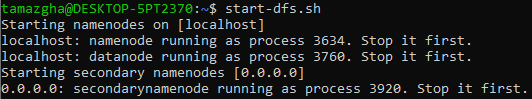

#  TP 1 : Manipulation du système de fichiers HDFS

## Objectifs du TP

L'objectif de ce TP est de se familiariser avec les opérations fondamentales dans Hadoop, y compris la création de répertoires, l'ajout et l'affichage de contenu, la copie et la suppression de fichiers, ainsi que l'exploration approfondie du système de fichiers.

### Étape 1 : Démarrage des Processus Hadoop
Dans cette première étape, nous allons lancer les processus essentiels de Hadoop. Utiliser les commandes start-dfs.sh et start-yarn.sh pour démarrer les processus Hadoop. Une fois cela fait, confirmer qu'ils sont en cours d'exécution en utilisant la commande jps. Pour vérifier visuellement l'état du système, accéder à l'interface web du NameNode en ouvrant votre navigateur à l'adresse http://localhost:50070.

<table>
    <tr>
        <td>
                

                    
                

        </td>
    </tr>
    <tr>
        <td>
                

                    
                

        </td>
    </tr>
    <tr>
        <td>
                

                    
                

        </td>
    </tr>
    <tr>
        <td>
                

                    
                

        </td>
    </tr>
</table>

### Étape 2: Manipulation des Fichiers

#### Créetion de la Structure Racine dans le HDFS

#### Création des Fichiers dans le Répertoire Cours de CPP : Dans le répertoire Cours/CPP, créez les fichiers CoursCPP1, CoursCPP2 et CoursCPP3. Assurez-vous d'ajouter du contenu à ces fichiers.

#### Affichage du Contenu des Fichiers : Utilisez la commande appropriée pour afficher le contenu des fichiers CoursCPP1, CoursCPP2 et CoursCPP3.

#### Copie des Fichiers dans le Répertoire Cours de l’JAVA : Copiez les fichiers CoursCPP1, CoursCPP2 et CoursCPP3 dans le répertoire Cours/Java.

#### Suppression et Renommage de Fichiers : Supprimez le fichier CoursCPP3 dans le répertoire Cours/Java. Ensuite, renommez CoursCPP1 en CoursJAVA1 et CoursCPP2 en CoursJAVA2.

#### Création des Répertoires pour les Travaux Pratiques : Dans le système de fichier local, créez les répertoires TP1CPP, TP2CPP, TP1JAVA, TP2JAVA et TP3JAVA.

#### Copie des Fichiers des Travaux Pratiques : Copiez les fichiers TP1CPP et TP2CPP du système de fichier local vers le répertoire TPs/CPP. De même, copiez les fichiers TP1CJAVA et TP2JAVA vers le répertoire TPs/Java

### Étape 3: Exploration et Suppression

#### Exploration et Suppression dans SDIA : Affichez récursivement le contenu du répertoire BDDC avec la commande appropriée. Ensuite, supprimez le fichier TP1CPP du répertoire TPs et supprimez le répertoire Java avec tout son contenu.

<table>
    <tr>
        <td>
                

                    
                

        </td>
    </tr>
    <tr>
        <td>
                

                    
                

        </td>
    </tr>
    <tr>
        <td>
                

                    
                

        </td>
    </tr>
</table>